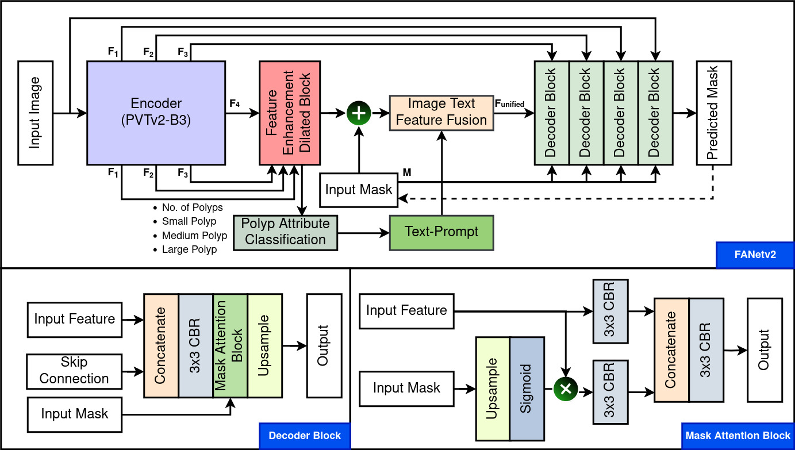
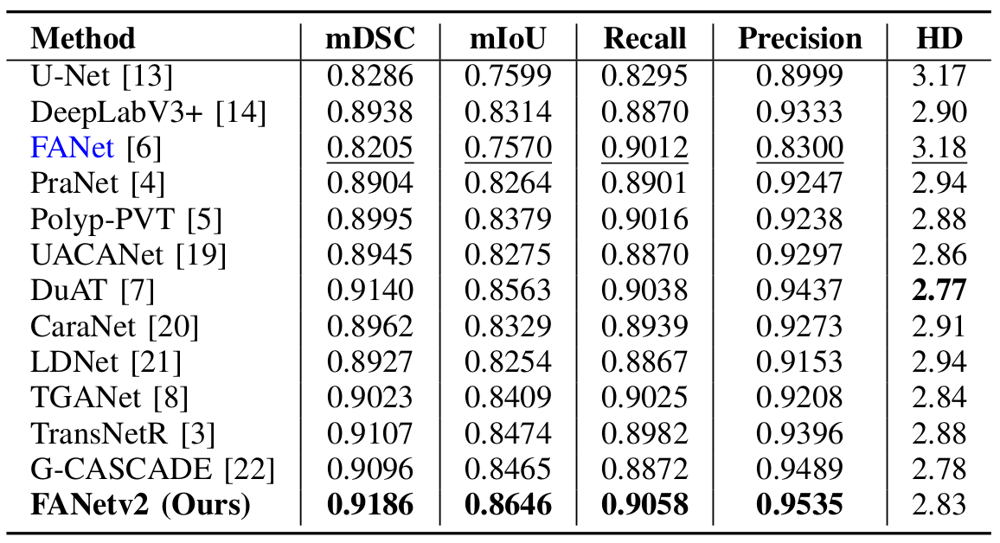
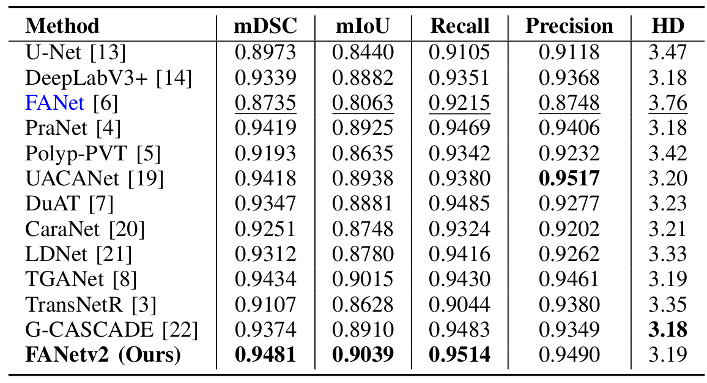
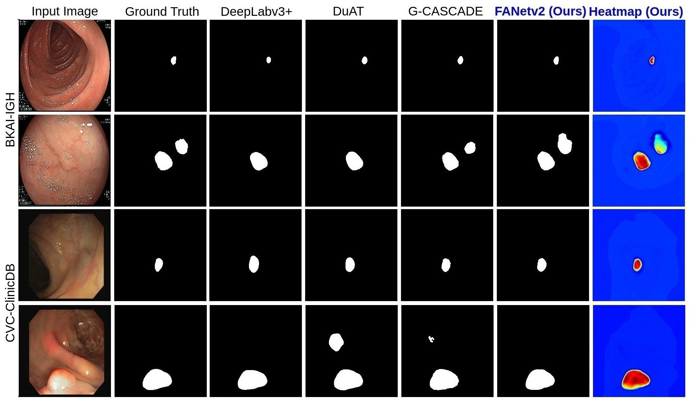

# TRANSFORMER-ENHANCED ITERATIVE FEEDBACK MECHANISM FOR POLYP SEGMENTATION

## 1. Abstract

Colorectal cancer (CRC) is the third most common cause of cancer diagnosed in the United States. Notably, CRC is the leading cause of cancer in younger men less than 50 years old. Colonoscopy is considered the gold standard for the early diagnosis of CRC. Skills vary significantly among endoscopists, and a high miss rate is reported. Automated polyp segmentation can reduce the missed rates, and timely treatment is possible in the early stage. To address this challenge, we introduce Feedback Attention Networkv2 (FANetv2), an advanced encoder-decoder network designed to accurately segment polyps from colonoscopy images. Leveraging an initial input mask generated by Otsu thresholding, FANetv2 iteratively refines its binary segmentation masks through a novel feedback attention mechanism informed by the mask predictions of previous epochs. Additionally, it employs a text-guided approach that integrates essential information about the number (one or many) and size (small, medium, large) of polyps to further enhance its feature representation capabilities. This dual-task approach facilitates accurate polyp segmentation and aids in the auxiliary classification of polyp attributes, significantly boosting the model’s performance. Our comprehensive evaluations on the publicly available BKAI-IGH and CVC-ClinicDB datasets demonstrate the superior performance of FANetv2, evidenced by high dice similarity coefficients (DSC) of 0.9186 and 0.9481, along with low Hausdorff distances of 2.83 and 3.19, respectively

## 2. Architecture

|  |
| :--: |
| *Overview of the FANetv2 architecture.* |

FANetv2 takes two inputs: a polyp image and an initial input mask generated from Otsu thresholding. The method is designed to perform two key tasks: an auxiliary polyp attribute classification and the polyp segmentation. The input image is initially fed to the encoder, which forwards its output to the Feature Enhancement Block, whose output is used for polyp attribute classification and the rest of the network for polyp segmentation. An innovative aspect of FANetv2 is that it uses an initial input mask and the polyp attributes to generate a unified feature representation, which is then passed to the decoder to predict the final segmentation mask. It is to be noted that FANetv2 has two key mechanisms: a feedback attention mechanism that leverages input mask from the previous epoch to guide the proposed network to refine segmentation and a text-guided mechanism that incorporates crucial information about the polyp, such as the number and size of polyps present within an image. These components work together to enhance the feature representation, thus improving the overall performance of the proposed FANetv2.

## 3. Implementation
The proposed architecture uses the PyTorch framework (1.9.0+cu111) with a single GeForce RTX 3090 GPU of 24 GB memory.

### 3.1 Dataset
We have used the following datasets:
- [BKAI](https://www.kaggle.com/competitions/bkai-igh-neopolyp/data)
- [CVC-ClinicDB](https://www.dropbox.com/s/p5qe9eotetjnbmq/CVC-ClinicDB.rar?dl=0)

All the datasets follow an 80:10:10 split for training, validation, and testing.

## 4. Results
### 4.1 Quantitative Results
|  |
| :--: |
| *Result of models trained and tested on BKAI-IGH* |

|  |
| :--: |
| *Result of models trained and tested on CVC-ClinicDB* |

### 4.2 Qualitative Results

## 5. Citation
<pre>
Updated soon.
</pre>

## 4. License
The source code is free for research and education use only. Any comercial use should receive a formal permission from the first author.

## 6. Contact
Please contact nikhilroxtomar@gmail.com for any further questions.
